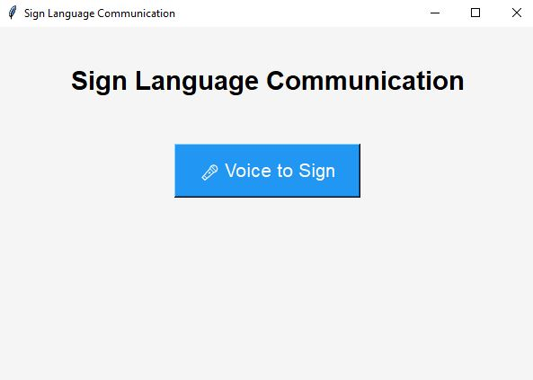
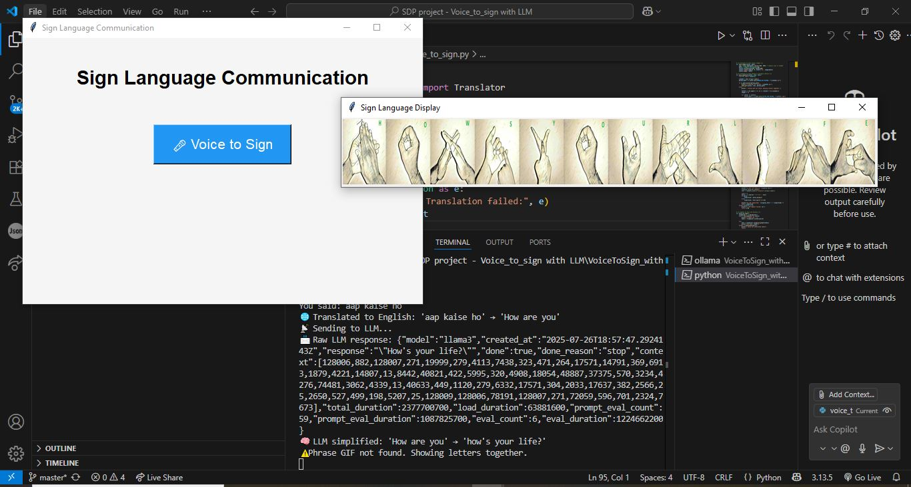

🗣️ Voice-to-Sign Language (ISL) Translator Using LLM

  
 

🌟 A Python-powered application that converts spoken language into Indian Sign Language (ISL) using animated sign GIFs or fallback alphabet images. With optional Local LLM (LLaMA via Ollama) integration, complex spoken phrases are simplified for accurate and meaningful translation.

🎬 Demo
🔗DemoVideo

[]

✨ Key Features
🎤 Voice Recognition
Real-time speech input using your microphone.

🌍 Multilingual Translation
Any language input is auto-translated to English before being processed.

🧠 LLM Integration (Optional)
Uses LLaMA via Ollama to simplify long or polite phrases for accurate ISL translation.

🖼️ Sign Display System
Translates directly into ISL using:

Phrase-based GIFs (e.g., good morning.gif)

Fallback character-by-character A–Z signs when phrase GIFs are unavailable.

🖥️ User-Friendly GUI
Built with Tkinter for a smooth desktop experience.

📁 Offline Capable
All GIFs and image assets are stored locally for usage without internet access.

📸 Screenshots

      

🔧 Tech Stack
Category	Tools Used
Language	Python
Voice Recognition	SpeechRecognition, PyAudio
GUI	Tkinter
Image/GIF Handling	PIL (Pillow), ImageTk, ImageSequence
LLM (Optional)	LLaMA 3 via Ollama
Phrase Assets	Local ISL phrase GIFs (ISL_Gifs/)
Fallback Mode	A–Z alphabet images (letters/ folder)

⚙️ Getting Started
1. Clone the Repository
bash
Copy
Edit
git clone https://github.com/Shravanimbh/Voice-To-Sign-ISL-with-LLM.git
cd Voice-To-Sign-ISL-with-LLM
2. Install Dependencies
Make sure you have Python 3.8+ installed, then run:

bash
Copy
Edit
pip install -r requirements.txt
3. Run the Application
bash
Copy
Edit
python main.py
🔁 Ensure your microphone is working and assets like ISL_Gifs and letters folders are correctly placed.

💡 How It Works
User speaks into the microphone 🎙️

Speech is transcribed to text using Google's Speech Recognition API

Text is translated to English, if not already

LLM simplifies complex phrases (optional)

Simplified phrase is matched to available sign GIFs

If no exact match: fallback to alphabet signs

Animated signs are displayed in the GUI 🧏‍♂️✨

🧠 Future Enhancements
Add full ISL dictionary support

Support live webcam gesture input (Sign-to-Voice)

Expand multilingual support with more accurate NLP models

Improve LLM prompt customization for finer control

## 👩‍💻 Contributors

This project was created by:

- [Shravani Bhosale](https://github.com/Shravanimbh)  
- [Arpita Chavan](https://github.com/Arp518)  

🤝 Contributing
Contributions, ideas, and feedback are welcome!
If you'd like to contribute to this project, feel free to fork it, raise issues, or submit pull requests.
